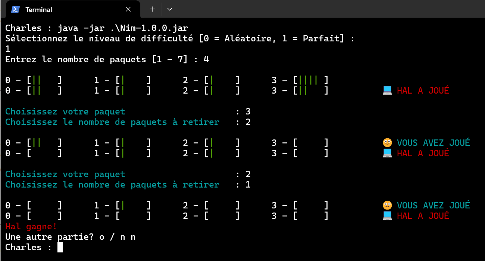

# Jeu de Nim

## Présentation

L'objectif de ce projet est de fournir une implémentation simple et fonctionnelle du jeu de Nim en mode console.

Les fonctionnalités sont les suivantes :

- Jeu en mode console avec interface textuelle
- Génération aléatoire de la configuration des paquets
- Stratégie aléatoire ou gagnante basée sur la théorie du jeu de Nim
- Possibilité de rejouer plusieurs parties
- Support des couleurs et emojis dans le terminal

Le programme est écrit en Java. La construction et le déploiement se font via Gradle.

## Aperçu

Exemple d'exécution du programme :

## À propos

Ceci est une présentation du projet. Il contient :

- Les fonctionnalités
- Un aperçu visuel
- La structure de base

Ce n'est pas le projet complet. Le projet complet incluant :

- 📚 Le tutoriel au format PDF
- 💻 Le code source complet
- ⚙️ Les fichiers de build Gradle

est disponible ici : 👉 **[Tutoriel - Jeu de Nim]()**

## Licence

© ChasThn. 2025 - Tous droits réservés.

Le contenu de ce répertoire est protégé par le droit d'auteur. Aucune utilisation, reproduction
ou distribution n'est autorisée sans permission écrite explicite.

Le tutoriel, les sources, les fichiers de build et de configuration accessibles via le lien de
téléchargement sont fournis avec leurs propres licences respectives détaillées.

##

